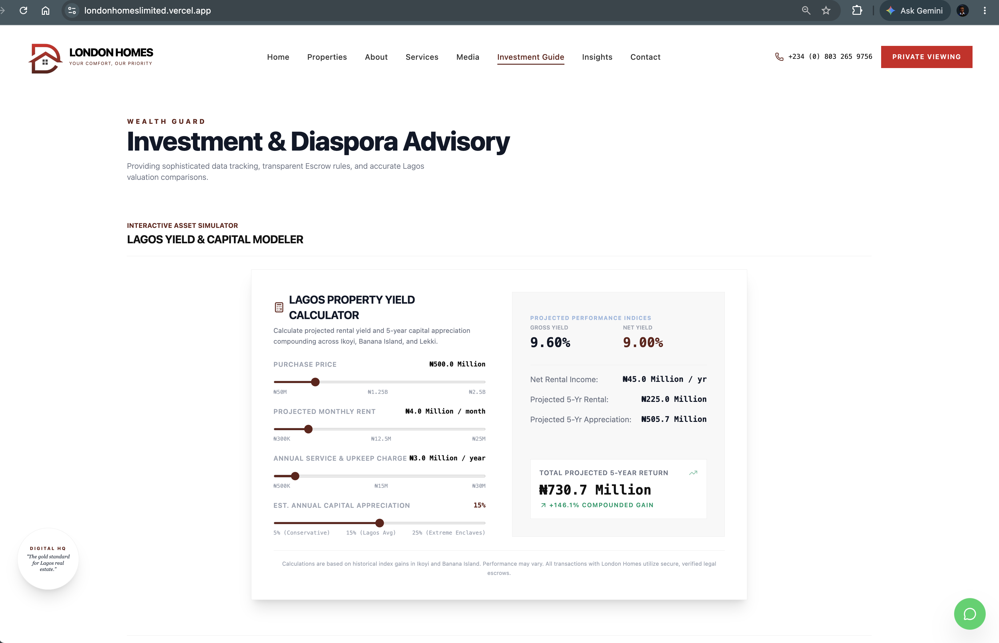

# London Homes Platform 🏡

A sophisticated real estate platform showcasing luxury properties and investment opportunities in Lagos, Nigeria. 
Built with modern web technologies, this platform provides an immersive user experience for discerning clients.

## 🚀 Project Overview

London Homes is a high-end real estate platform designed to serve the luxury property market in Lagos. It offers detailed listings, an interactive ROI calculator, neighborhood guides, and a seamless interface for scheduling viewings and consultations. The platform emphasizes trust, security, and data-driven insights for investors and discerning homebuyers.

## ✨ Future Key Features

*   **Interactive Property Listings:** Browse a curated portfolio of luxury villas, penthouses, apartments, and off-plan developments with high-quality imagery and detailed descriptions.
*   **Advanced Filtering & Search:** Easily find properties based on location, price range, property type, number of bedrooms, and acquisition status.
*   **ROI Calculator:** An integrated tool to estimate potential rental yields and capital appreciation for properties in prime Lagos areas.
*   **Neighborhood Guides:** In-depth information on prestigious Lagos locations like Ikoyi, Banana Island, and Lekki Phase 1.
*   **Secure Investment Advisory:** Services focused on guiding diaspora and local investors through secure transactions with legal due diligence and escrow systems.
*   **Virtual Tours & Media Gallery:** High-definition video walkthroughs and visual content to showcase properties.
*   **Responsive Design:** Optimized for seamless viewing across all devices.
*   **User-Friendly Interface:** Intuitive navigation and clear calls to action for scheduling viewings and inquiries.
*   **Trust & Security Focus:** Emphasis on title verification, secure escrow, and professional representation.

## 🛠️ Tech Stack

*   **Frontend:** React, TypeScript, Vite, Tailwind CSS, Lucide React, motion
*   **Backend (Implied):** Node.js, Express (used for `npm run dev` potentially serving the Vite app or a separate API).
*   **AI Integration:** @google/genai (Google Generative AI)
*   **Social Media Integration:** react-social-media-embed, react-instagram-embed
*   **Icons:** @icons-pack/react-simple-icons, lucide-react
*   **Build Tools:** Vite
*   **State Management:** React Hooks (useState, useEffect, useRef)

## 🚀 Installation & Setup

**Prerequisites:**
*   Node.js (LTS recommended)
*   npm or yarn package manager

**Steps:**

1.  **Clone the Repository:**
    ```bash
    git clone https://github.com/MITCHYUGAN/London_Homes_Platform.git
    cd London_Homes_Platform
    ```

2.  **Install Dependencies:**
    ```bash
    npm install
    ```
    *or*
    ```bash
    yarn install
    ```

3.  **Run the Development Server:**
    ```bash
    npm run dev
    ```
    *or*
    ```bash
    yarn dev
    ```
    This command will start the Vite development server, typically on `http://localhost:3000`.

## 💡 Usage Examples

1.  **Browsing Properties:** Navigate to the "Properties" page to view available listings. Use filters for location, price, and property type.
    

2.  **Estimating ROI:** Use the interactive "Lagos Yield & Capital Modeler" on the "Investment Guide" page to forecast potential returns.
    

3.  **Scheduling a Viewing:** Click on "Private Viewing" in the header or "Book Inspection" on a property card to schedule a chauffeured tour.
    

4.  **Exploring Neighborhoods:** Visit the "Prime Locations" section on the homepage to learn about key Lagos districts.
    

## 📂 Project Structure
```
London_Homes_Platform/
├── public/
│   ├── images/
│   │   ├── ceo_img.png
│   │   ├── digital-systems-engineer_img.jpeg
│   │   ├── ... (other images)
│   └── videos/
│       └── drone-video.mp4
├── src/
│   ├── components/
│   │   ├── Footer.tsx
│   │   ├── Header.tsx
│   │   ├── InspectionModal.tsx
│   │   ├── LuxuryViewportVideo.tsx
│   │   ├── PropertyCard.tsx
│   │   └── RoiCalculator.tsx
│   ├── data.ts
│   ├── index.css
│   ├── main.tsx
│   └── App.tsx
│   └── types.ts
├── .env.example
├── index.html
├── package.json
├── README.md
├── tsconfig.json
└── vite.config.ts
```

## 📚 Dependencies

*   `@google/genai`: For potential AI-powered features.
*   `@icons-pack/react-simple-icons`: Icon library.
*   `@tailwindcss/vite`: Tailwind CSS integration with Vite.
*   `@vitejs/plugin-react`: React plugin for Vite.
*   `dotenv`: Loads environment variables from `.env` files.
*   `express`: Web application framework (likely used for the dev server or API).
*   `lucide-react`: Popular icon library.
*   `motion`: Animation library (likely Framer Motion).
*   `react`, `react-dom`: Core React libraries.
*   `react-social-media-embed`: For embedding social media content.
*   `vite`: Build tool and development server.
*   `@types/express`, `@types/node`, `@types/react`: TypeScript type definitions.
*   `autoprefixer`: CSS post-processor.
*   `tailwindcss`: Utility-first CSS framework.
*   `tsx`: JavaScript/TypeScript runtime.
*   `typescript`: Language compiler.

## 🚀 How to Contribute

We welcome contributions to the London Homes Platform! Please follow these steps:

1.  Fork the repository.
2.  Create a new branch for your feature or bug fix (`git checkout -b feature/AmazingFeature`).
3.  Make your changes and commit them (`git commit -m 'Add some AmazingFeature'`).
4.  Push to the branch (`git push origin feature/AmazingFeature`).
5.  Open a Pull Request.

Please ensure your code adheres to the project's coding standards and includes relevant tests if applicable.

## 🔗 Important Links

*   **Live Demo:** [London Homes Limited](https://londonhomeslimited.vercel.app/)
*   **Repository:** [MITCHYUGAN/London_Homes_Platform](https://github.com/MITCHYUGAN/London_Homes_Platform)
*   **Author Profile:** [MITCHYUGAN](https://github.com/MITCHYUGAN)

## 🌟 Footer

© 2023 London_Homes_Platform | [Repository Link](https://github.com/MITCHYUGAN/London_Homes_Platform) | Developed by MITCHYUGAN
